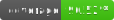

# Substreamer

**Stream your music library on iOS and Android — free and open source.**

## Screenshots

  
  &nbsp;
  
  &nbsp;
  
  &nbsp;
  

## Highlights

**Playback** — Background audio, lock screen controls, adjustable playback speed, shuffle and repeat modes, queue management.

**Offline Use** — Download albums and playlists for offline listening, background download queue with progress and automatic recovery, automatic offline mode (if you leave wifi or if you leave your home wifi network specifically), manual offline mode switch at any time, configurable storage limits and visibility of storage use, configurable download Quality.

**Ratings & Favorites** — 5-star ratings for songs, albums, artists (server support dependant), star albums, artists, and songs, dedicated favorites view with filtering, download favorites and keep them in sync with new changes.

**Scrobbling** — Automatic scrobble submission to your server with offline support. Scrobbles are queued locally when offline and submitted automatically when you reconnect.

**Listening Analytics** — Listening history, activity heatmaps, top artists, albums, and songs by play count, most active hours, listening streaks

**Search** — Quick search access on any main screen, Full search for more results from your entire library, automatically switches to seaching your downloaded content when in offline mode.

**Playlist Management** - Add any song to any playlist or create a new one on the fly, remove or re-order tracks in any saved playlist, quick access to save Artist Top Songs as a new playlist or save your current player queue as a new playlist.

**Sharing** - full support for sharing albums or playlists (currently Navidrome only), allows you to set a server address override in case you have a different public address for people to access what you share with them, quick copy to clipboard so you can share it anywhere.  Full share management functionality in settings.

**Metadata** - Allow MusicbrainzID (MBID) overrides to be set in app, users can search on the artist detail screen to easily correct an incorrect match or choose the right MBID if the server does not provide one.

**Metadata Management** - The storage and data section in settings gives you access to a wealth of information, you can browse, refresh or remove any offline metadata, cached images or downloaded music, pending and completed scrobbles and more.  Great for the curious or for when something funky happens and you just want to know what or quickly fix it!

**Appearance** — Light, dark, and system theme modes, custom accent colors, list and grid layout toggles and default settings, alphabetical quick-scroll for large libraries.

**Backup** - Substreamer does a few things that are outside what the subsonic API accomodates (MBID Overrides, Listening history and analytics) to deal with this we need to keep some detail locally with your app and we don't want it to be lost if you have to re-install the app or get a new device (No one wants to break their listening streak!).  This data is automatically set to be included in your devices native cloud backups.

## Compatible Servers

Substreamer works with any server implementing the [Subsonic API](http://www.subsonic.org/pages/api.jsp).

| Server | Notes |
|--------|-------|
| [Navidrome](https://www.navidrome.org/) | Recommended. Full API support including OpenSubsonic extensions. |
| [Gonic](https://github.com/sentriz/gonic) | Lightweight, full API support. |
| [Airsonic-Advanced](https://github.com/airsonic-advanced/airsonic-advanced) | Community fork of Airsonic. |
| [Ampache](https://ampache.org/) | Supports Subsonic API compatibility mode. |
| [Supysonic](https://github.com/spl0k/supysonic) | Python-based, lightweight. |
| [Funkwhale](https://funkwhale.audio/) | Supports Subsonic API compatibility mode. |
| [Subsonic](http://www.subsonic.org/) | The original. |

## Getting Started

1. **Set up a server** — Install a Subsonic-compatible server to host your music. [Navidrome](https://www.navidrome.org/docs/installation/) is a great place to start.

2. **Download Substreamer** — Get the app for free on the [App Store](https://apps.apple.com/us/app/substreamer/id1012991665) or [Google Play](https://play.google.com/store/apps/details?id=com.ghenry22.substream2).

3. **Connect** — Open the app, enter your server URL and credentials, and start streaming.

## Community

- **Reddit:** [r/substreamer](https://www.reddit.com/r/substreamer/)
- **Bug reports & feature requests:** [GitHub Issues](https://github.com/ghenry22/substreamer/issues)
- **Contributing:** Pull requests are welcome! See [CONTRIBUTING.md](CONTRIBUTING.md) to get started.

## License

Substreamer is licensed under the [GNU General Public License v3.0](LICENSE).

You are free to use, modify, and distribute this software under the terms of the GPL-3.0. Any derivative works must also be distributed under the same license. See the [LICENSE](LICENSE) file for the full text.
